**Suricata Intrusion Detection System (IDS) Project Report**

**1. Project Title:**
 Implementation and Testing of Suricata IDS in a Virtualized Lab Environment

**2. Purpose of the Project**

The purpose of this project is to deploy and configure **Suricata**, an open-source Intrusion Detection System (IDS), in a controlled virtual lab environment. The project demonstrates how Suricata can be used to detect common network attacks such as ICMP reconnaissance, Nmap scans, packet flooding, and SSH brute-force attempts through custom rule creation and traffic analysis.

**3. Executive Summary**

In this project, Suricata IDS was installed and configured on an Ubuntu virtual machine to monitor network traffic within a private virtual network. Custom detection rules were written to identify ICMP ping activity, Nmap scanning techniques, hping3-based flooding, and SSH brute-force attempts. Traffic was generated from an attacker machine (Kali Linux) targeting a vulnerable system (Metasploitable 2). The results confirmed that Suricata successfully detected and logged malicious activities, validating its effectiveness as a network-based intrusion detection solution.

**4. Lab Environment** 

The lab environment consisted of three virtual machines connected on the same network: 

Suricata Host: Ubuntu VM 
  IP Address: `192.168.72.128` 
Target Machine: Metasploitable 2 VM 
  IP Address: `192.168.72.129` 
Attacker Machine: Kali Linux VM 
  IP Address: `192.168.72.130` 

**5. Installation of Suricata** 

5.1 Installation Steps 

1. Navigated to the official Suricata website: https://suricata.io

 

2. Accessed the documentation section for Ubuntu package installation.

 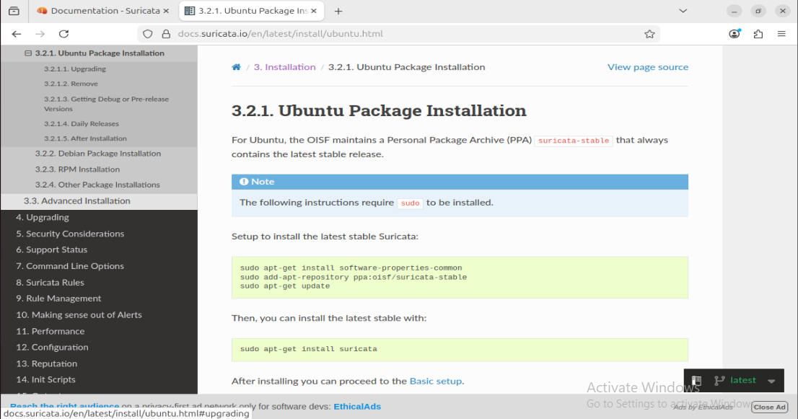

3. Added the OISF Suricata repository: 
  sudo add-apt-repository ppa:oisf/suricata-stable

  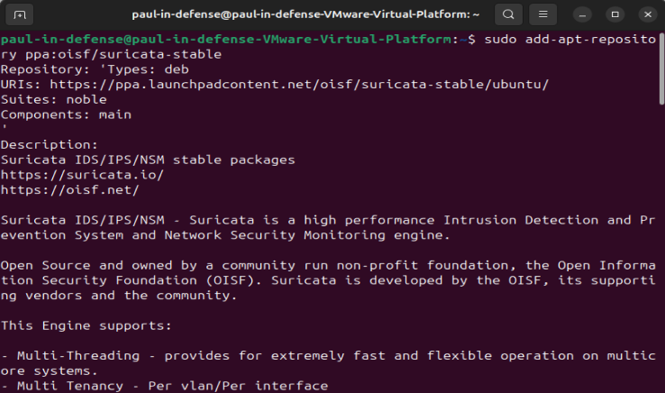

4. Updated the package list and installed Suricata: 
   sudo apt-get update

    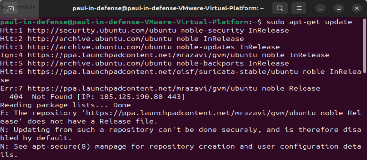

   sudo apt-get install suricata -y

    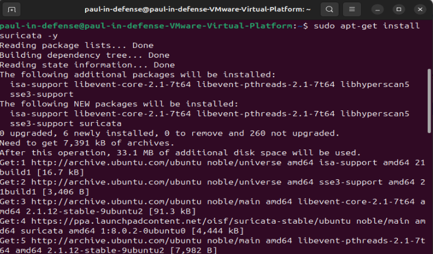

5. Verified the status of Suricata: 
   sudo systemctl status suricata

   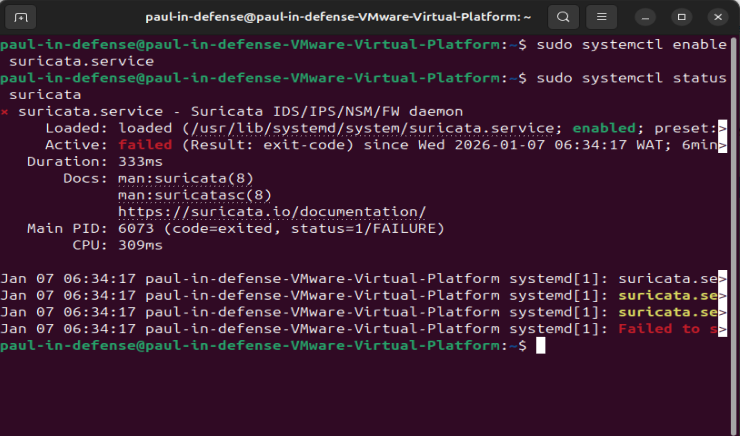

**5.2 Troubleshooting Suricata Service** 
  In cases where Suricata failed to start, the following steps were applied: 

sudo suricata-update

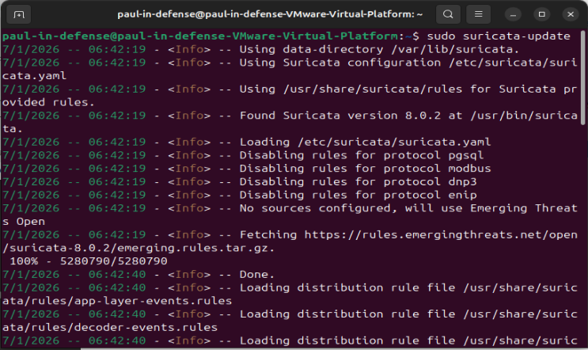

sudo systemctl daemon-reload 
sudo systemctl restart suricata 
sudo systemctl status suricata 

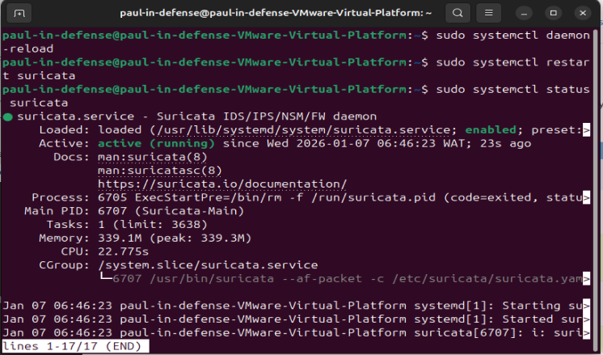

Suricata should display an **active (running)** status after these steps. 

**6. Rule Creation and Organization** 

 **6.1 Rules Directory Setup** 
 
 A dedicated directory was created to store all Suricata rules: 
  sudo mkdir -p /etc/suricata/rules 

  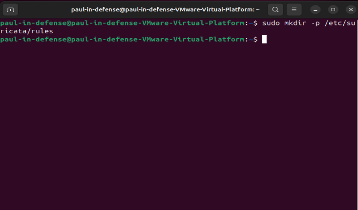

Each detection rule was placed in a separate file for better organization and management.

**6.2 ICMP Rule** 

File: /etc/suricata/rules/icmp.rules 
alert icmp any any -> any any (msg:"ICMP Ping Detected"; itype:8; sid:100001; rev:1;)

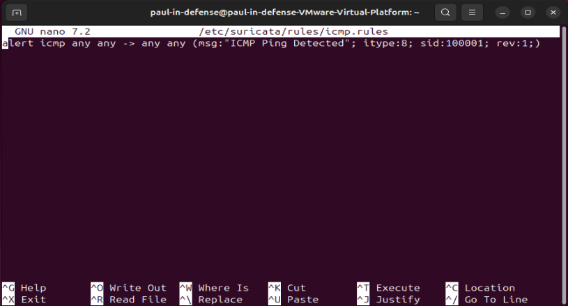

This rule detects ICMP echo request (ping) activity.

**6.3 Nmap Scan Rules** 

File: /etc/suricata/rules/nmap.rules 
alert tcp any any -> any any (msg:"Nmap SYN Scan Detected"; flags:S; threshold:type both, track by_src, count 10, seconds 3; sid:1000003; rev:1;) 
alert tcp any any -> any any (msg:"Nmap Null Scan Detected"; flags:0; sid:1000004; rev:1;) 
alert tcp any any -> any any (msg:"Nmap FIN Scan Detected"; flags:F; sid:1000005; rev:1;) 

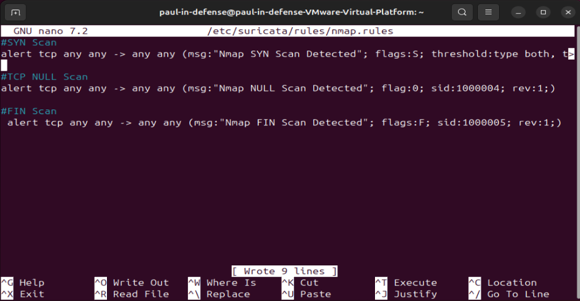

These rules detect common Nmap scanning techniques.

**6.4 hping3 Flood Rules** 

File: /etc/suricata/rules/hping3.rules 
alert tcp any any -> any any (msg:"Possible hping3 TCP Packet Flood"; flags:S; threshold:type both, track by_src, count 20, seconds 1; sid:1000006; rev:1;) 
alert icmp any any -> any any (msg:"hping3 ICMP Flood Detected"; threshold:type both, track by_src, count 10, seconds 1; sid:1000007; rev:1;) 

 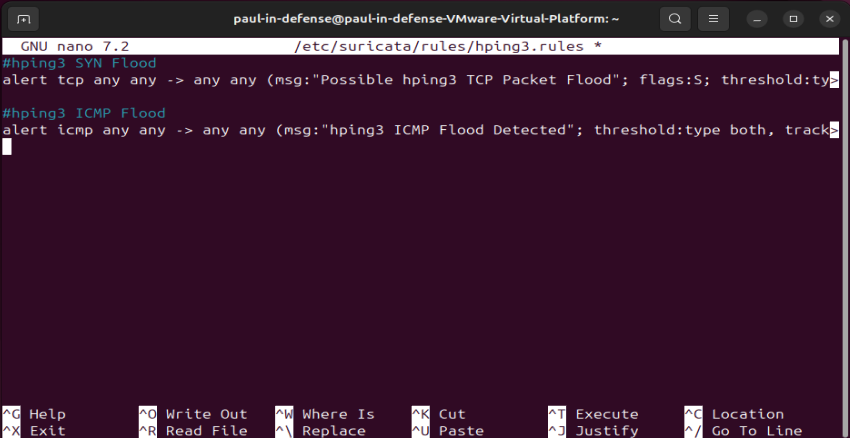

These rules detect packet flooding attacks generated using hping3.

**6.5 SSH Brute-Force Rule** 

File: /etc/suricata/rules/ssh.rules 
alert tcp any any -> any 22 (msg:"Possible SSH Bruteforce"; flow:to_server; threshold:type both; sid:1000009; rev:1;) 

 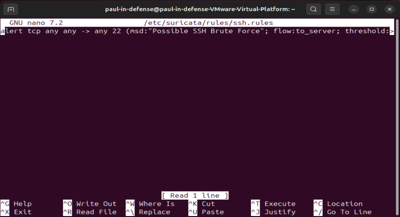

This rule detects suspicious SSH connection attempts.

**7. Suricata Configuration**

The main Suricata configuration file is located at: 
/etc/suricata/suricata.yaml

**Configuration Changes Made** 

HOME_NET was set to: 
 [192.168.72.0/24] 
EXTERNAL_NET was left as `any`.

 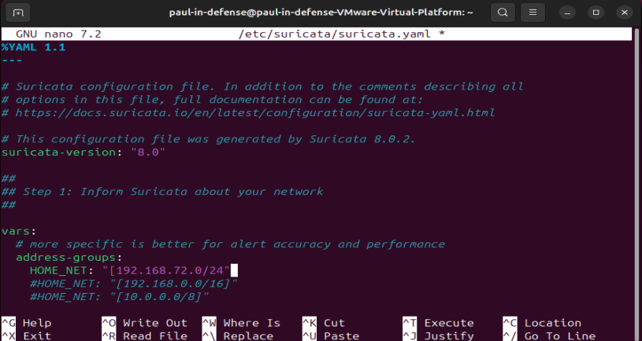

 Network interface was set to `ens33`.

 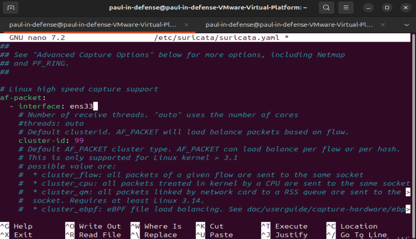

All custom rule files were added: 
  /etc/suricata/rules/icmp.rules 
  /etc/suricata/rules/nmap.rules 
  /etc/suricata/rules/hping3.rules 
  /etc/suricata/rules/ssh.rules 

  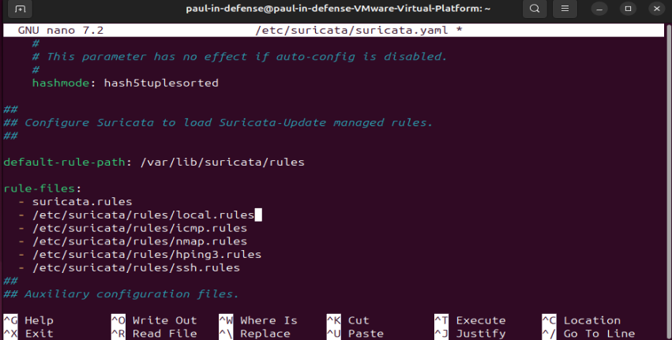

**8. Testing and Validation**

**8.1 ICMP Test:** 
 ping target-ip

 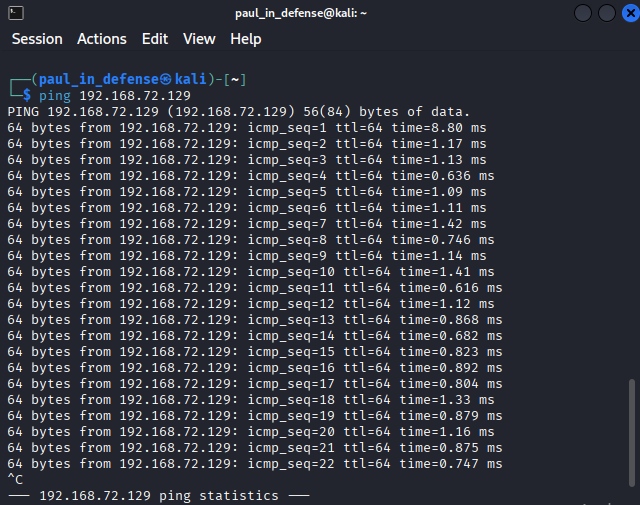

**8.2 Nmap Scan Test** 
 nmap -sS target-ip

 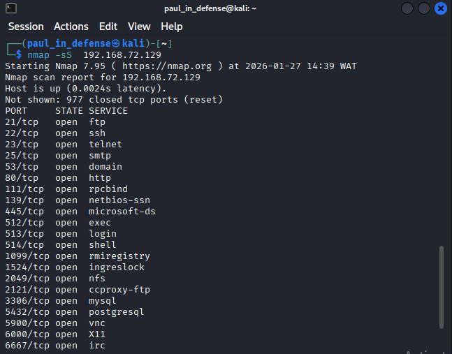

**8.3 hping3 Flood Test** 
 sudo hping3 -S --flood -V target-ip

 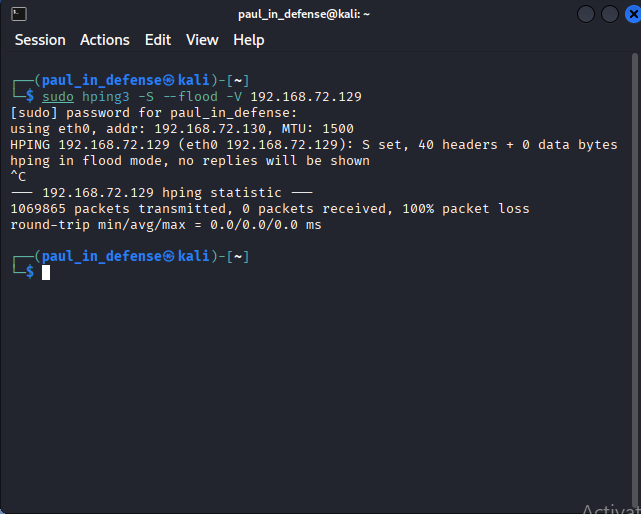

**8.4 SSH Test** 
 ssh user@target-ip

 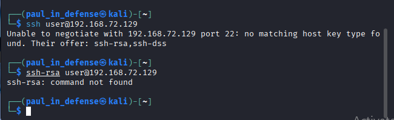

**9. Results and Log Analysis**

Suricata was restarted to ensure all rules were loaded: 
sudo systemctl restart suricata

Alerts generated by Suricata were viewed using: 
sudo cat /var/log/suricata/fast.log

Or in real-time using: 
sudo tail -f /var/log/suricata/fast.log

**Icmp Suricata Test Result** 

 

**Nmap Suricata Test Result**

 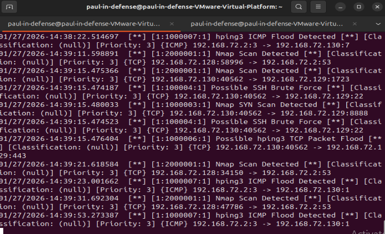

**hping3 Suricata Test Result**

 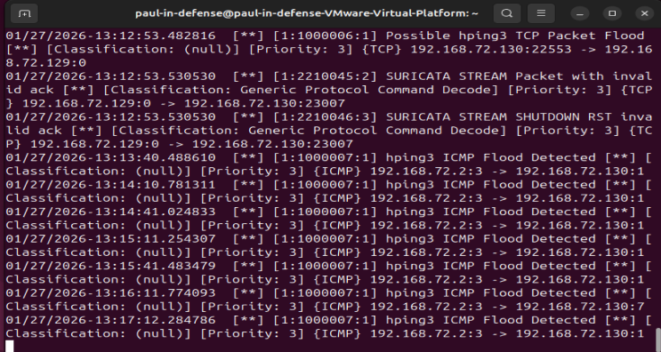

**SSH Suricata Test Result**

 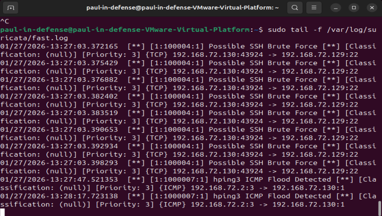

The logs confirmed successful detection of all simulated attack activities.

**10. Conclusion**

This project successfully demonstrated the deployment and configuration of Suricata IDS in a virtual environment. By creating custom detection rules and generating attack traffic, Suricata proved effective in identifying and logging malicious network behavior. This highlights its value as a powerful open-source IDS for monitoring and improving network security.
