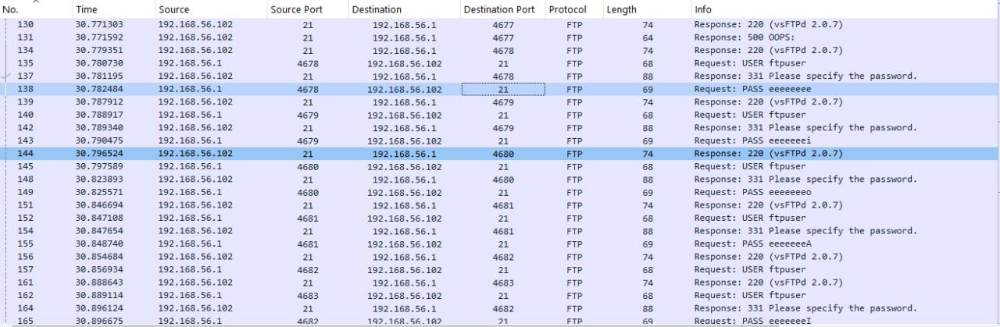
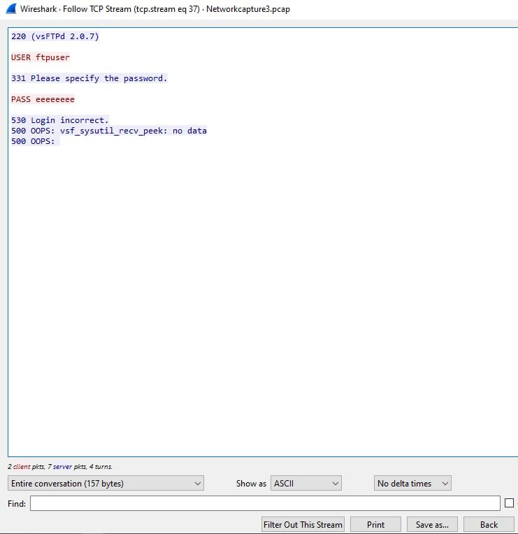
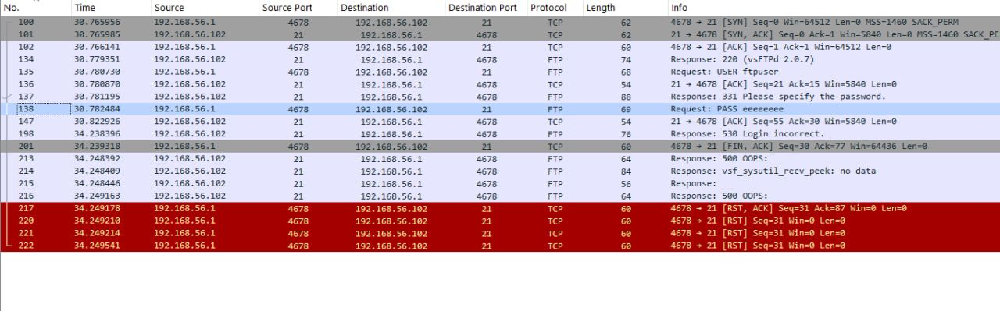

<strong>Network Security Analysis & Incident Response Evaluation</strong>

<strong>Project Type:</strong> Network Traffic Analysis · Incident Response · SOC Fundamentals 
<strong>Tools:</strong> Wireshark 
<strong>Frameworks:</strong> CyBOK Incident Response Model, SANS Incident Handler’s Handbook 
<strong>Date:</strong> October 25, 2025

<strong>Analyst:</strong> Yohanna Paul Sheawaza

 <strong>Confidentiality Notice:</strong>

This project simulates an internal SOC investigation scenario. All IP addresses, traffic, and findings are based on controlled lab data and are used strictly for educational and portfolio purposes.

 <strong>Executive Summary:</strong>

This project documents the investigation of a multi-stage internal network compromise identified through detailed packet capture (PCAP) analysis. The analysis revealed a critical security posture failure, driven by the continued use of an insecure legacy protocol and the absence of layered defensive controls.

<strong>Key Findings:</strong>

The investigation confirmed three concurrent attack vectors: 
	1.	Credential Compromise via FTP Brute-Force Attacks 
	•	Repeated login attempts against an insecure FTP service resulted in clear-text credential exposure. 
	2.	Internal Lateral Movement 
	•	Stealth port scanning and suspicious communication patterns between internal hosts indicated an attacker foothold and internal reconnaissance. 
	3.	Multiple Internal Attack Sources 
	•	Malicious activity originated from several internal IP addresses, suggesting either multiple compromised hosts or coordinated insider-level behavior. 

<strong> Critical Risk Identified:</strong>
The use of FTP, a clear-text protocol, enabled credential theft and allowed attackers to pivot internally.

<strong>High-Level Recommendation:</strong> 

Immediate decommissioning of FTP, migration to secure file transfer protocols (SFTP/FTPS), and enforcement of Multi-Factor Authentication (MFA) are required to prevent recurrence.

<strong> Project Objectives & Scope:</strong> 

<strong>Objectives:</strong> 
	•	Detect and analyze malicious network activity within PCAP files 
	•	Assess attack severity and business impact 
	•	Evaluate the effectiveness of the CyBOK Incident Response Model in a real SOC-style scenario 
	•	Provide clear, actionable remediation recommendations 

<strong>Scope:</strong> 
	•	Analysis limited strictly to provided PCAP files 
	•	Primary network range: 192.168.56.0/24 

<strong>Out of Scope:</strong> 
	•	Endpoint logs (EDR) 
	•	Host-based event logs 
	•	Firewall and SIEM telemetry outside PCAP data 

<strong> Methodology:</strong> 

<strong>The investigation followed a structured SOC-aligned workflow:</strong> 
	•	Data Source: Packet Capture (PCAP) files 
	•	Primary Tool: Wireshark 
	•	Detection Techniques:<br?
	•	FTP credential inspection 
	•	SYN-only scans 
	•	Repeated authentication failures 
	•	Patterned low-volume traffic indicative of C2 communication 

Example Filters Used: 
	•	ftp.request.command == "PASS" 
	•	tcp.flags.syn == 1 && tcp.flags.ack == 0

<strong> Findings & Analysis:</strong> 

The analysis uncovered multiple overlapping security incidents, confirming an active internal compromise. 

<strong>Capture 1:</strong> FTP Brute Force attack 

  i. Attacker IP: 192.168.56.1 
  ii. Target IP: 192.168.56.102 
  iii. Repeated Login attempts on FTP port 21, exposing clear-text credentials 
  iv. Severity: High 

   

   

   

**Capture 2:** Stealth Scanning 

 i. Attacker IP: 192.168.56.102 
 ii. Target IP: 192.168.56.101 
 iii. Description: Internal reconnaissance for open ports 
 iv: Severity: Medium 

 

**Capture 3:** Control Communication

 i. Attacker IP: 192.168.56.102 
 ii. Target IP: 192.168.56.101 
 iii. Description: Patterned traffic consistent with command and control activity. 
 iv. Severity: High 

 

**Capture 4:** FTP Brute force attack 

 i. Attacker IP: 192.168.56.101 
 ii. Target IP: 192.168.56.102 
 iii. Description: Reverse-direction brute force attempts 
 iv.  Severity: High 

 

 

**Capture 5:** FTP Brute Force attack 

 i. Attacker IP: 192.168.56.1 
 ii. Target IP: 192.168.56.101 
 iii. Desccription: New host targeted by original attacker 
 iv. Severity: High 

**Capture 6:** Suspicious login 

 i. Attacker IP: 192.168.56.102 
 ii. Target IP: 192.168.56.101 
 iii. Description: Possible succcessful authentication post-attack 
 iv. Severity: High 

 **Interpretation & Impact:**
	•	Clear-Text Credential Exposure: FTP allowed attackers to directly read usernames and passwords from network traffic. 
	•	Confirmed Lateral Movement: Compromised hosts actively scanned and communicated with internal systems. 
	•	Threat Severity: The combination of credential theft, internal pivoting, and multiple attack sources elevates this incident to Critical severity. 

 

**Incident Response Evaluation**

**Application of the CyBOK Incident Response Model**

The CyBOK Incident Response Model provides a structured, end-to-end framework for managing security incidents, ensuring that detection, response, and recovery activities are handled systematically rather than reactively. Applying this model to the identified network compromise highlights both the strengths of structured incident handling and the gaps that allowed the attack to succeed.

**Preparation**

The Preparation phase focuses on ensuring that security controls, tools, policies, and monitoring capabilities are in place before an incident occurs. In the context of this investigation, this phase represents the most significant failure. The continued use of the File Transfer Protocol (FTP), a legacy protocol that transmits credentials in clear text, indicates a lack of protocol governance and secure configuration standards. Proper preparation would have included decommissioning insecure services, enforcing encrypted alternatives such as SFTP or FTPS, and implementing multi-factor authentication (MFA). Had these controls been in place, the primary attack vector—credential compromise via brute force—would have been effectively neutralized.

**Detection and Analysis**

The Detection and Analysis phase involves identifying suspicious activity, validating that an incident has occurred, and determining its scope and impact. In this project, packet capture (PCAP) analysis using Wireshark served as the primary detection mechanism. Repeated FTP login attempts, clear-text credential transmission, SYN-based scanning behavior, and patterned low-volume traffic were identified as indicators of compromise. Analysis of these indicators confirmed not only external-style brute-force behavior but also internal lateral movement between hosts. This phase demonstrates how network traffic analysis can reveal both initial access techniques and post-compromise attacker behavior. However, it also highlights a detection gap, as such high-volume and repetitive activity should ideally trigger real-time alerts from an IDS or SIEM rather than being discovered post-event through manual analysis.

**Containment, Eradication, and Recovery**

Once the incident was confirmed, the CyBOK model emphasizes rapid containment to prevent further damage. In this scenario, containment would require immediate isolation of all identified compromised hosts to stop ongoing brute-force attempts, scanning, and control communications. Eradication would involve removing any malicious artifacts, terminating unauthorized access, and revoking all potentially exposed credentials. Because credentials were transmitted in clear text, password resets alone would be insufficient without also eliminating the insecure protocol that enabled the compromise. Recovery focuses on restoring services securely, which in this case includes deploying encrypted file transfer services, applying necessary system patches, and validating that rebuilt hosts are free of persistence mechanisms before reconnecting them to the network.

**Post-Incident Activity**

The Post-Incident Activity phase ensures that lessons learned from the incident are translated into long-term security improvements. For this investigation, this phase is critical, as the root cause was not a zero-day vulnerability but an avoidable configuration and policy failure. A formal post-incident review would document the risks associated with legacy protocol usage, the lack of internal network segmentation, and insufficient detection of brute-force behavior. Recommendations such as mandatory MFA, improved internal firewalling, intrusion prevention systems, and stronger monitoring rules should be incorporated into organizational policy and training. This phase shifts the organization from a reactive posture to a proactive security stance, reducing the likelihood and impact of similar incidents in the future.

**Overall Value of the CyBOK Model**

Applying the CyBOK Incident Response Model to this scenario demonstrates its strength as a comprehensive and knowledge-driven framework. It not only guides technical response actions but also emphasizes governance, policy enforcement, and organizational learning. In complex, multi-stage incidents like this one, the model ensures that response efforts address both immediate threats and the systemic weaknesses that enabled the compromise.

**Recommendations:**

 i. Decommission FTP Services: Replace all FTP services with secure alternatives like SFTP/FTPS. 
 ii. Implement Multi-Factor Authentication (MFA): Enforce MFA to prevent credential compromise. 
 iii. Monitor Internal Traffic: Use IDS/IPS solutions to detect and block lateral movement and C2 communication. 
 iv. Conduct Regular Security Audits: Periodically review and update security configurations. 

**Lessons Learned:**
	•	Legacy protocols are silent killers in modern networks 
	•	Detection without prevention leads to delayed response 
	•	Flat networks amplify damage after compromise 

**Conclusion:**

This investigation confirms a critical internal network compromise driven by insecure protocol usage and insufficient internal controls. By eliminating FTP, enforcing MFA, improving segmentation, and strengthening detection, the organization can significantly improve its security posture.

This project demonstrates real-world SOC skills in:
	•	Network traffic analysis 
	•	Incident response reasoning 
	•	Framework-based security evaluation 
	•	Actionable remediation planning 

**References:**
	•	CyBOK – Incident Response 
	•	SANS Incident Handler’s Handbook 
	•	NIST SP 800-61r2 
	•	Wireshark Documentation 
