**Vulnerability Assessment Report**

**Target:** Metasploitable 2 
**Tool:** Tenable Nessus 
**Platform:** Ubuntu Linux 
**Assessment Type:** Basic Network Scan (Unauthenticated) 
**Date:** 8 November 2025 

**1. Executive Summary**

A vulnerability assessment was performed using Nessus Essentials installed on an Ubuntu virtual machine, targeting a Metasploitable 2 VM on the same network.

The scan identified 72 vulnerabilities, including 6 critical findings, alongside numerous high, medium, and low severity issues. These results are expected due to the intentionally insecure nature of the target, but they clearly illustrate the types of risks that would be unacceptable in a production environment.

This exercise validates both the installation and operational use of Nessus and highlights the value of vulnerability scanning in identifying and prioritizing security weaknesses.

 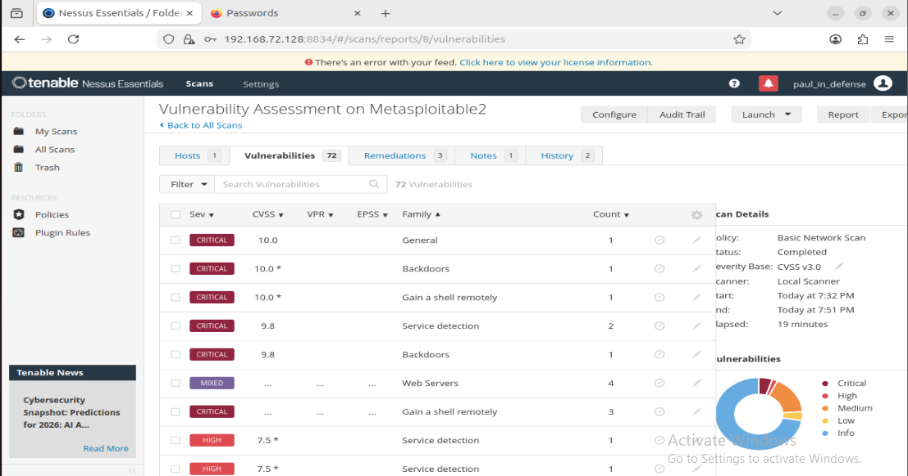

**2. Objectives**

   i. Install and configure Nessus on Ubuntu

   ii. Perform host discovery and target validation

   iii. Execute a vulnerability assessment scan

   iv. Analyze vulnerability severity and risk

   v. Document findings and recommendations clearly

**3. Environment & Prerequisites**

   The assessment environment consisted of the following:

   i. Two virtual machines on the same NAT network

  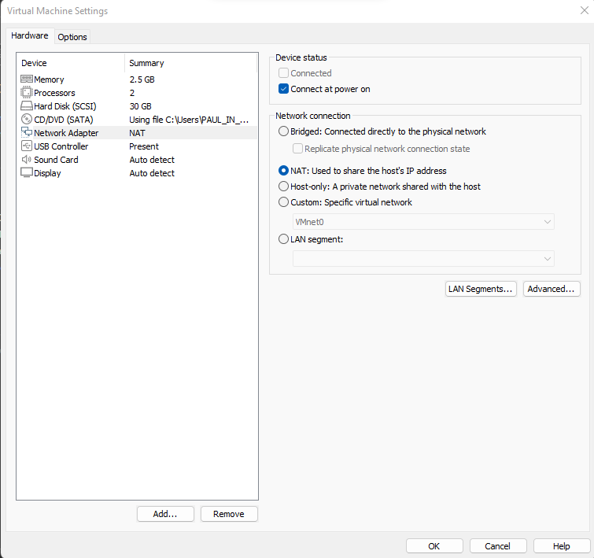

   ii. Scanner VM: Ubuntu with Nessus installed

  

   iii. Target VM: Metasploitable 2

  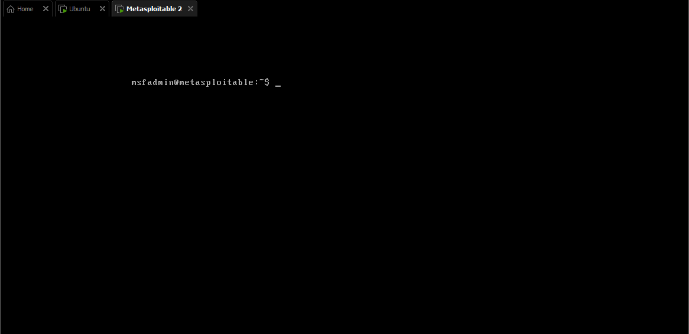

   iv. Browser access on the scanner VM

   v. Valid email address for Nessus Essentials activation

**4. Installing Nessus on Ubuntu**

   Nessus was installed using the Debian package provided by Tenable.

**4.1 Installation Steps**

   i. Navigated to the Nessus Essentials download page and downloaded the Debian package.

   ii. Completed the registration form and received an activation code via email.

   iii. Opened a terminal and navigated to the Downloads directory:

     cd Downloads
      ls

   iv. Installed the package:

     sudo dpkg -i Nessus-<version>.deb

 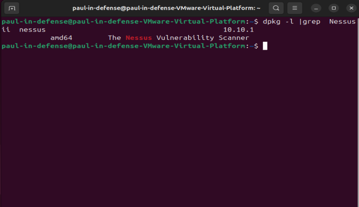

   v. Started and verified the Nessus service:

     sudo systemctl start nessusd sudo systemctl status nessusd

 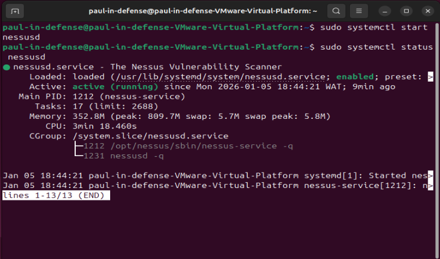

   vi. Accessed the Nessus web interface:

     https://<scanner-IP>:8834

   vii. The browser SSL warning was bypassed to proceed.

   viii. Entered the activation code and created an administrator account.

   ix. Waited for the plugin feed to download and install.

  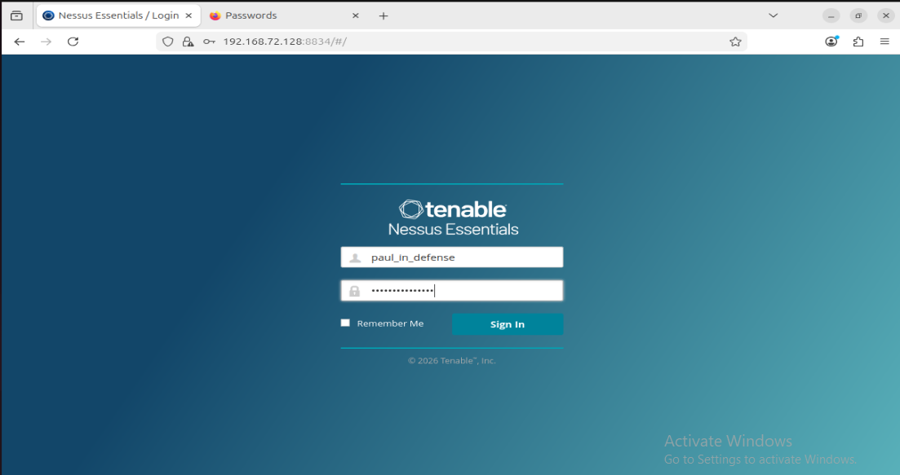

**5. Assessment Methodology & Scan Configuration**

  **5.1 Network Preparation**

   i. Verified both VMs were reachable on the same NAT network.

   ii. Confirmed connectivity using ping.

   iii. Performed host discovery using fping.

     fping -a -g <subnet>

 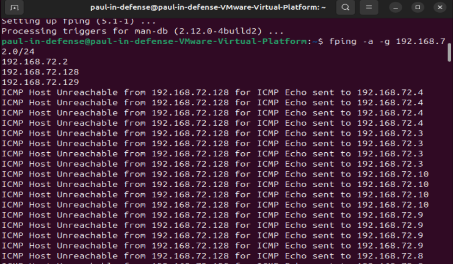

**5.2 Scan Configuration**

   i. Logged into the Nessus web interface.

   ii. Created a new scan using Basic Network Scan.

  

   iii. Added:

     - Scan name
     - Description
     - Target IP address (Metasploitable 2)
 
  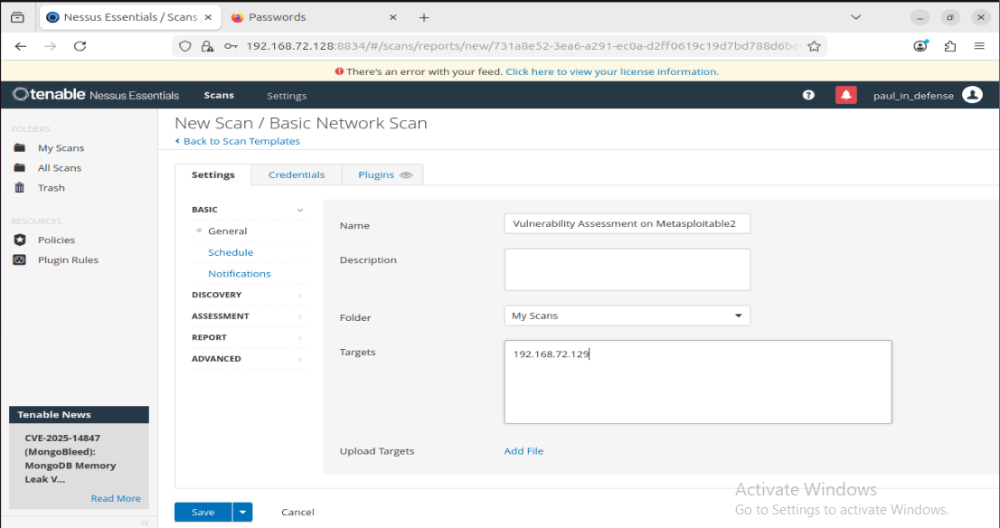

   iv. Saved and launched the scan.

 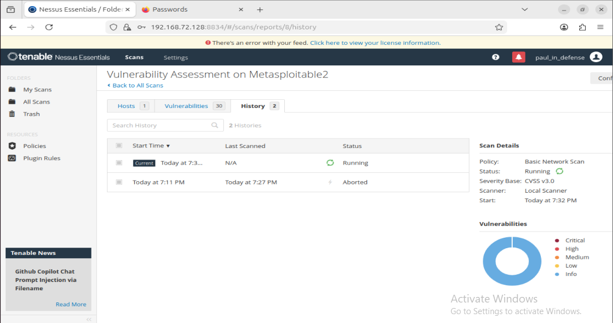

   v. Monitored progress until completion (~19 minutes).

**6. Key Findings**

 **6.1 Summary**

   i. Total vulnerabilities: 72

   ii. Critical: 6

   iii. High / Medium / Low: Remaining findings distributed across severity tiers

  **6.2 Observed Vulnerability Categories**
  
  Examples of vulnerability types commonly identified on Metasploitable 2 include:

   i. Exposed services with default or weak credentials

   ii. UnrealIRCD Backdoors Detection

   iii. Unpatched and outdated software

   iv. Known remote code execution vectors

   v. Privilege escalation weaknesses

   vi. Information disclosure services

**Note:** Metasploitable 2 is intentionally vulnerable. These findings are expected and serve educational purposes.

 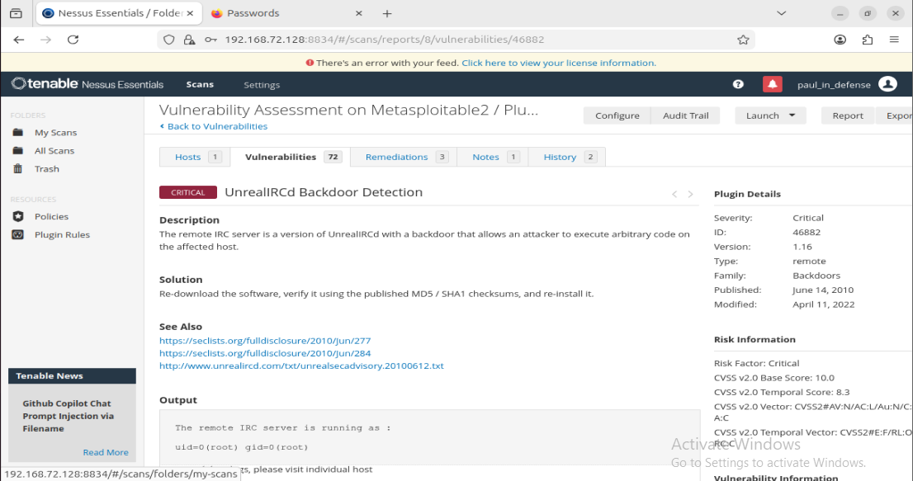

**7. Recommendations**

  **7.1 For Training & Test Environments**
  
   i. Strictly isolate intentionally vulnerable systems.

   ii. Use firewall rules and network segmentation to prevent lateral movement.

  **7.2 For Production Environments**

   i. Remediate critical and high-severity vulnerabilities immediately.

   ii. Patch vulnerable software and remove unsafe services.

   iii. Enforce least privilege and secure configuration baselines.

   iv. Segment networks to reduce attack surface.

   v. Schedule regular vulnerability scans.

 **7.3 Operational Best Practices**

   i. Perform authenticated scans where possible.

   ii. Re-scan systems after remediation to confirm fixes.

   iii. Correlate scan results with logs and threat intelligence.

  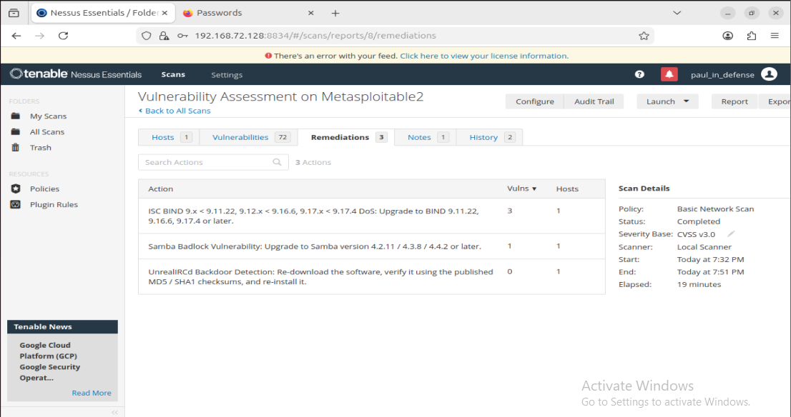

**8. Limitations**

   i. The scan was unauthenticated, which limits visibility into host-level configuration issues.

   ii. Results reflect an intentionally insecure system and do not represent a hardened production environment.

   iii. Authenticated scans would provide deeper insights into patch levels, permissions, and misconfigurations.

**9. Conclusion**

This vulnerability assessment successfully demonstrated the installation, configuration, and use of Nessus to identify security weaknesses in a controlled lab environment.

While the vulnerabilities discovered are expected due to the nature of Metasploitable 2, the exercise reinforces the importance of automated vulnerability scanning as part of a mature security program. In real-world environments, the same approach — paired with remediation and validation — helps organizations proactively reduce risk.

